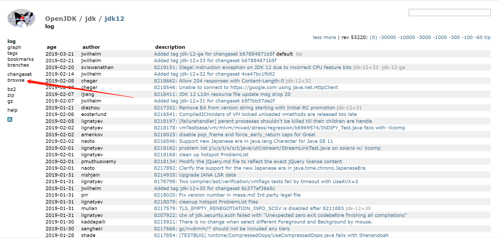
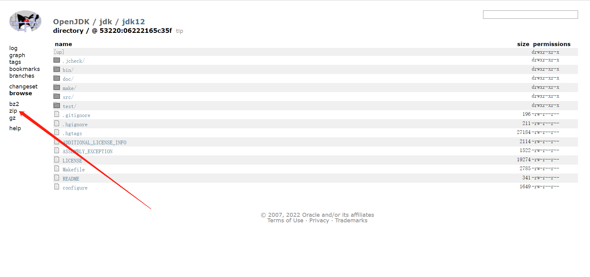
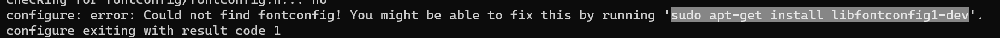

## 源码下载

访问https://hg.openjdk.java.net/jdk/jdk12/，点击左侧的browser,如果所示：



然后点击zip格式，下载压缩包的文件：



## 环境准备

准备一台linux服务器，例如：Ubuntu 18.04 LTS，安装编译工具GCC：

```shell
sudo apt-get install build-essential
```

还需要安装openjdk编译需要的依赖库FeeType，CUPS等第三方库：

```shell
sudo apt-get install libfreetype6-dev # FreeType
sudo apt-get install libcups2-dev # CUPS
sudo apt-get install libx11-dev libxext-dev libxrender-dev libxrandr-dev libxtst-dev libxt-dev # X11
sudo apt-get install libasound2-dev # ALSA
sudo apt-get install autoconf # Autoconf
```

我们还需要一个地本版的openjdk，例如，需要编译的openjdk为12，那么需要准备一个11的openjdk，因为openjdk有多个部分组成（HotSpot，JDK类库，JAXWS,JAXP...），其中HotSpot部分代码是由C、C++编写，而更多的是用java编写的，因此要编译这些java代码的话，需要编译期间可用的JDK，官方称这个JDK为“Bootstrap JDK”。编译OpenJDK 12时，Bootstrap JDK必须使用JDK 11及之后的版本。

```shell
sudo apt-get install openjdk-11-jdk
```

上述环境都准备完成之后，接下来就可以进行openjdk的编译

## 编译

我们可以通过默认的配置进行编译，也可以通过定制化的方式进行编译，进入源码所在的目录，可以通过命令：bash configure --help 查看有哪些配置项可以指定，例如：bash configure --enable-debug  -with-jvm-variants=server（可选值server，client，minimal，core，zero，custom），其中--enable-debug等效于：-with-debug-level=fastdebug（可选值为：release，fastdebug，showdebug），configure命令会检查依赖项，参数配置和输出目录结构，如果编译过程中需要的工具链或者依赖项有缺失，将会得到明确的提示信息，如下所示：



可以看到提示已经很清晰了，只需要执行如下命令即可：

```shell
sudo apt-get install libfontconfig1-dev
```

