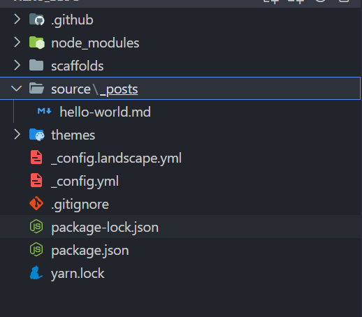
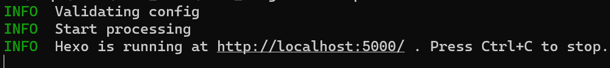
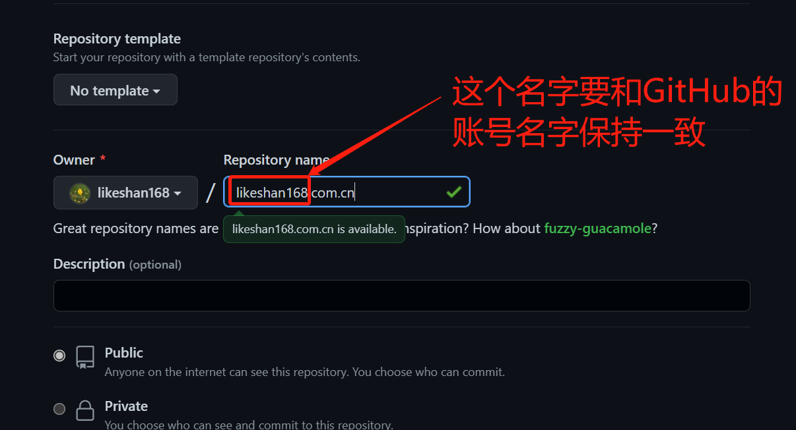
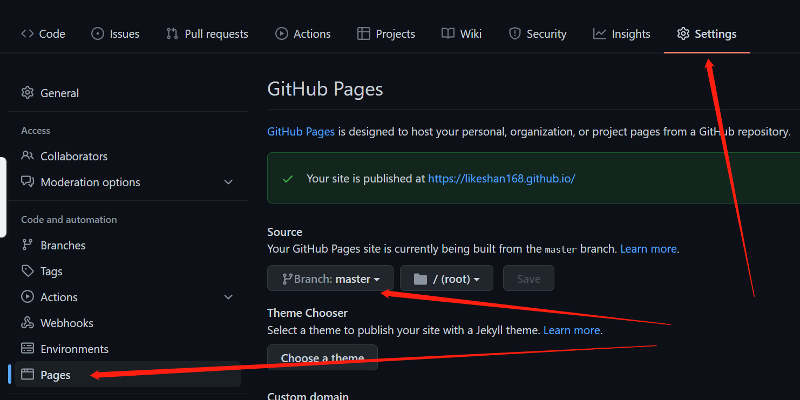
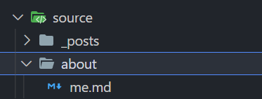
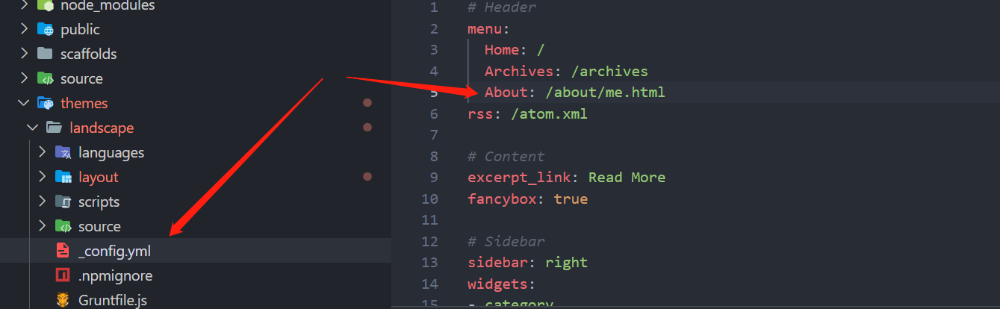

## Hexo环境搭建

- [Node.js](http://nodejs.org/) (Node.js 版本需不低于 10.13，建议使用 Node.js 12.0 及以上版本)
- [Git](http://git-scm.com/)
- 安装hexo: npm install -g hexo-cli

完成上述操作之后，我们就可以通过hexo 命令创建项目

```shell
hexo init hexo_blog
cd hexo_blog
npm install
```

创建完成之后，可以看到我们的目录结构如下：



其中_config.yml是网站的配置文件，关于各个文件夹是用来做什么的，可以参考[hexo](https://hexo.io/zh-cn/docs/setup)官方文档，其中有比较详细的介绍。接下，我们通过如下的命令运行该项目：

```shell
hexo g //生成静态文件
hexo s //启动服务
```



服务已经成功启动，由于，默认的4000端口已经被占用，我就通过  hexo s -p 5000 指定了端口，然后在浏览器中输入：http://localhost:5000 可以看到运行的结果。

## github pages

首先得要有GitHub的账号，然后创建一个项目



创建完成之后，我们就可以通过https://likeshan168.com.cn进行访问，现在由于没有内容，所以会提示404，接下来我们就将hexo_blog发布到GitHub上

## 发布到GitHub

- 安装[hexo-deployer-git](https://github.com/hexojs/hexo-deployer-git)：npm install hexo-deployer-git --save

- 修改_config.yml文件的deploy配置：

```yaml
deploy:
  type: 'git'
  repository: https://github.com/likeshan168/likeshan168.com.cn.git
  branch: master
```

- 运行hexo clean && hexo d

- 设置一下likeshan168.com.cn项目Pages中的开发分支（这里指定的分支名称就是_config.yml中deploy指定的分支名称）

  

- 访问https://likeshan168.com.cn，看是否部署成功

如果在本地访问没有问题，部署到github pages查看样式都不对的话，修改_config.yml文件中的url=https://likeshan168.com.cn/(改成你自己项目的地址)

## 创建新页面

创建一个about me的页面：

```shell
hexo new page --path about/me "About me"
```

执行完命令之后就能看到在source目录下创建了about目录，about目录下多了me.md文件：


添加菜单：



重新生成一下静态文件

```shell
hexo g
hexo s
```

可以看到About的菜单生成了


最后，将我们的修改推送到GitHub上即可

```shell
hexo d
```

刷新https://likeshan168.com.cn就可以看到我们的更新，至此，通过hexo+github pages进行博客系统的搭建基本已经讲完，关于hexo比较详细的操作流程，还需参考官网，谢谢。
