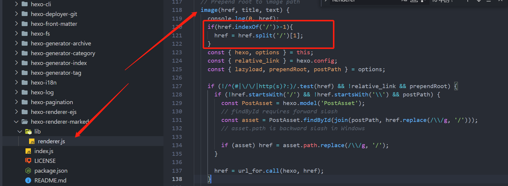

问题现象，通过hexo创建完项目之后，通过typora编辑md文件，插入图片，本地开发是能显示图片的，但是发布到github上就显现不了，主要的原因肯定是路径的问题，[hexo](https://hexo.io/zh-cn/docs/asset-folders)官网也给了解决的办法

## 资源文件夹

直接引用官网的解释：

资源（Asset）代表 `source` 文件夹中除了文章以外的所有文件，例如图片、CSS、JS 文件等。比方说，如果你的Hexo项目中只有少量图片，那最简单的方法就是将它们放在 `source/images` 文件夹中。然后通过类似于 `` 的方法访问它们。

对于那些想要更有规律地提供图片和其他资源以及想要将他们的资源分布在各个文章上的人来说，Hexo也提供了更组织化的方式来管理资源。这个稍微有些复杂但是管理资源非常方便的功能可以通过将 `config.yml` 文件中的 `post_asset_folder` 选项设为 `true` 来打开。

```
post_asset_folder: true
```

当资源文件管理功能打开后，Hexo将会在你每一次通过 `hexo new [layout] <title>` 命令创建新文章时自动创建一个文件夹。这个资源文件夹将会有与这个文章文件一样的名字。将所有与你的文章有关的资源放在这个关联文件夹中之后，你可以通过相对路径来引用它们，这样你就得到了一个更简单而且方便得多的工作流

## 相对路径引用的标签插件

通过常规的 markdown 语法和相对路径来引用图片和其它资源可能会导致它们在存档页或者主页上显示不正确。在Hexo 2时代，社区创建了很多插件来解决这个问题。但是，随着Hexo 3 的发布，许多新的[标签插件](https://hexo.io/docs/tag-plugins#Include-Assets)被加入到了核心代码中。这使得你可以更简单地在文章中引用你的资源。

```



```

比如说：当你打开文章资源文件夹功能后，你把一个 `example.jpg` 图片放在了你的资源文件夹中，如果通过使用相对路径的常规 markdown 语法 `` ，它将 *不会* 出现在首页上。（但是它会在文章中按你期待的方式工作）

正确的引用图片方式是使用下列的标签插件而不是 markdown ：

```

```

通过这种方式，图片将会同时出现在文章和主页以及归档页中。

这种方式，在本地开发中不是太友好

## 在markdown文件中嵌入图片

首先引用 [hexo-renderer-marked](https://github.com/hexojs/hexo-renderer-marked) 包

```
npm install hexo-renderer-marked --save
```

然后修改_config.yml文件

```
post_asset_folder: true
marked:
  prependRoot: true
  postAsset: true
```

开启了之后，图片资源就会自动解析成对应的图片路径。比如：“test.jpg” 位于 “/2022/04/25/test/test.jpg”,

```
` 将会转换成 `
```

这种方式，虽然能解决发布之后图片展示的问题，但是不能解决本地typora编辑的问题，例如：有如下的目录结构：


编辑hexo-github.md文件，如果写成：

这种相对路径之后，能在typora中显示图片，但是在网页上就不能展示图片，如果改成下面这种：


能在网页上显示图片，但是在typora中又不能显示，这个时候，我们就通过修改插件 hexo-renderer-marked 的代码，来兼容两方的需求，找到图片路径转换的代码：



其中红框中的代码就是新加的，这样我们在md文件中，路径写成：hexo-github/image-20220423232811690.png 这样，就能同时在typora和网页上进行展示，

```
hexo clean
hexo g
hexo s
```

查看没有问题

```
hexo d
```

最后发布到GitHub上，完美解决图片路径的问题。
