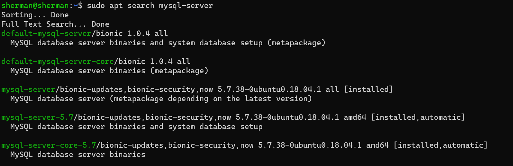
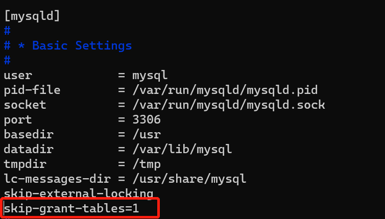

## 前言

最近在windows系统下安装了一个Ubuntu18.04.5的Linux系统，然后直接使用Ubuntu包管理工具装了MySql数据库，装的过程中没有提示任何有关root密码的信息（也许是我没有仔细观察，这不重要），这就需要能通过某种方式可以找到MySql的初始密码，或者修改原有的root密码。

## 安装MySql

可以先通过`sudo apt search mysql-server`看看包源提供了那些MySql的版本

执行：`sudo apt install mysql-server`等待安装完成，查看服务的状态：`sudo service mysql status`发现服务未启动，执行命令`sudo service mysql start`启动MySql服务，查看MySql的服务状态已经启动，如果在启动的过程中发现如下的错误信息：mkdir: cannot create directory ‘//.cache’: Permission denied，可以通过命令`sudo cat /etc/passwd`查看MySql用户的相关信息如下：

说明MySql用户的home目录不存在，需要将其改成如下：

修改完成之后重新启动MySql服务`sudo service mysql restart`，错误消失，服务也正常启动了，接下就该登录MySql服务器，看看相关的数据库和表了，但是由于不知道root的密码，也就没有办法登录了

## 修改密码

- 修改 /etc/mysql/mysql.conf.d/mysqld.cnf文件，在[mysqld]下面添加一行代码：`skip-grant-tables=1`

  

- 重启启动MySql服务：`sudo service mysql restart`
- 登录MySql：mysql -u root -p(不需要输入密码，直接enter进入)
- 执行语句：`alter user 'root'@'localhost' IDENTIFIED WITH my_native_password BY '123456';`，可能会提示：he MySQL server is running with the --skip-grant-tables option so it cannot execute this statement的错误信息，执行`flush privileges;`即可
- 退出，将文件/etc/mysql/mysql.conf.d/mysqld.cnf中`skip-grant-tables=1`删除或者注释掉，重启MySql服务
- 重新登录MySql：mysql -u root -p 输入密码：123456，就可以正常登录了

至此，root的密码也就修改成功了。在初始化安装的时候，会有一个初始化的密码，也可以通过查看`/var/log/mysqld.log`文件的记录能查到初始的root密码，`sudo grep 'temporary password' /var/log/mysqld.log`，但是我执行了该命令，发现文件/var/log/mysqld.log不存在，估计是我的环境问题，如果大家也有遇到这种情况，可以参考一下，或许有点帮助。
