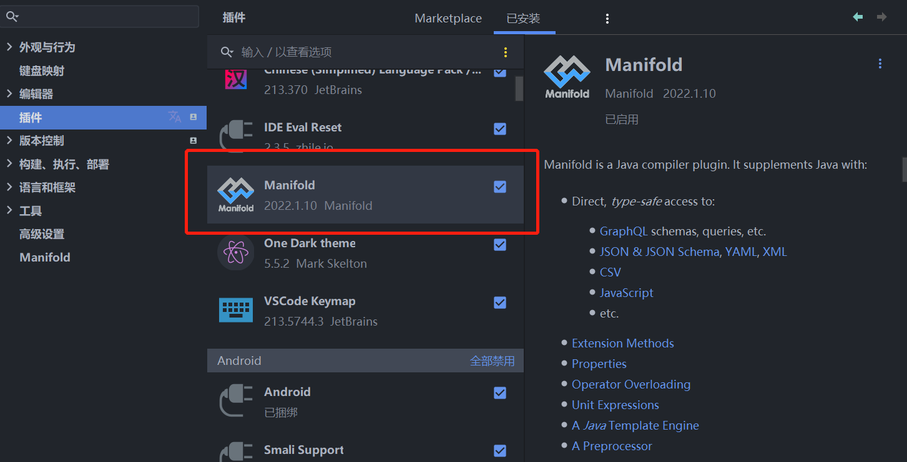

## 扩展方法

如果想要对现有的类添加新的方法，但是又不太可能去修改原有类的时候，我们就可以通过扩展方法进行扩展（当然，也有其他的方式可以达到目的），java原生是不支持扩展方法的，熟悉其他语言的同学可能知道，例如：C#、go、kotlin等都是原生支持扩展方法的，那如果想在java中也要实现扩展方法，比如：“hello world”.print();实现 这样的功能，该如何做呢？

## Manifold介绍

Manifold是一个java的编译插件，其中包含了很多的功能，其中扩展方法就是其中之一，更多的功能介绍可以参考[官网](http://manifold.systems/)以及[源代码](https://github.com/manifold-systems/manifold)

接下来我们简单地通过代码的方式看看manifold是如何实现扩展方法的。

- 首先，添加依赖，参考pom.xml文件如下

```xml
<?xml version="1.0" encoding="UTF-8"?>
<project xmlns="http://maven.apache.org/POM/4.0.0" xmlns:xsi="http://www.w3.org/2001/XMLSchema-instance" xsi:schemaLocation="http://maven.apache.org/POM/4.0.0 http://maven.apache.org/maven-v4_0_0.xsd">
    <modelVersion>4.0.0</modelVersion>

    <groupId>com.example</groupId>
    <artifactId>my-ext-app</artifactId>
    <version>0.1-SNAPSHOT</version>

    <name>My Java Extension App</name>

    <properties>
        <!-- set latest manifold version here --> 
        <manifold.version>2022.1.14</manifold.version>
    </properties>
    
    <dependencies>
        <dependency>
            <groupId>systems.manifold</groupId>
            <artifactId>manifold-ext-rt</artifactId>
            <version>${manifold.version}</version>
        </dependency>                                                                                                     
    </dependencies>

    <!--Add the -Xplugin:Manifold argument for the javac compiler-->
    <build>
        <plugins>
            <plugin>
                <groupId>org.apache.maven.plugins</groupId>
                <artifactId>maven-compiler-plugin</artifactId>
                <version>3.8.0</version>
                <configuration>
                    <source>11</source>
                    <target>11</target>
                    <encoding>UTF-8</encoding>
                    <compilerArgs>
                        <!-- Configure manifold plugin-->
                        <arg>-Xplugin:Manifold</arg>
                    </compilerArgs>
                    <!-- Add the processor path for the plugin -->
                    <annotationProcessorPaths>
                        <path>
                            <groupId>systems.manifold</groupId>
                            <artifactId>manifold-ext</artifactId>
                            <version>${manifold.version}</version>
                        </path>
                    </annotationProcessorPaths>
                </configuration>
            </plugin>
        </plugins>
    </build>
</project>
```

- 定义一个类，例如：StringExtension

```java
package extensions.java.lang.String;

import manifold.ext.rt.api.Extension;
import manifold.ext.rt.api.This;

@Extension
public class StringExtension {
    public static void print(@This String thiz) {
        System.out.println(thiz);
    }

    @Extension
    public static String lineSeparator() {
        return System.lineSeparator();
    }

    @Extension
    public static String sayHello(String name) {
        return "hello " + name;
    }
}
```

特别说明下：扩展的包的定义是有一定的限制，所有的扩展类必须是在`extensions`包下面定义，后面加上要扩展的类的包，例如上代码：`extensions.java.lang.String`,在java9以及后续的版本中，我们还可以加上自己的模块名称，比如：com.test，那么扩展的包名就可以是：`com.test.extensions.java.lang.String`,在java8中`extensions`必须是根。

扩展方法所在的类必须添加@Extension注解，扩展方法必须是静态的公共方法，而且第一个参数为：@This+扩展的类型+参数名称，如果是静态的扩展方法那么需要在静态方法上面加@Extension注解，参数不再需要@This 进行限定，定义完成之后我们可以通过如下的方式进行调用了

```java
"hello world".print();
System.out.println(String.sayHello("sherman"));
```

当然，为了更棒的体验，还是要在idea中装一个插件Manifold



## 其他类型扩展

比如，我想针对Iterable<T>这个类型进行扩展，可以参考如下的代码：

```java
package extensions.java.lang.Iterable;

import manifold.ext.rt.api.Extension;
import manifold.ext.rt.api.Self;
import manifold.ext.rt.api.This;

import java.util.NoSuchElementException;
import java.util.function.Predicate;

@Extension
public class CollectionExtension {
    public static <T> T first(@This Iterable<T> thiz, Predicate<T> predicate) {
        for (T element : thiz) {
            if (predicate.test(element)) {
                return element;
            }
        }

        throw new NoSuchElementException();
    }
}
```

```java
List<String> list = new ArrayList<>();
list.add("one");
list.add("two");
list.add("three");
Predicate<String> getFirst = s -> Objects.equals(s, "one");
String first = list.first(getFirst);
System.out.println(first);
```

Manifold已经为我们提供了一些扩展

- **Collections**

  定义在manifold-io模块中，扩展了以下的类

  - java.io.BufferedReader
  - java.io.File
  - java.io.InputStream
  - java.io.OutputStream
  - java.io.Reader
  - java.io.Writer

- **Text**

  定义在manifold-text模块中，扩展了以下的类

  - java.lang.CharSequence
  - java.lang.String

- **I/O**

  定义在manifold-io模块中，扩展了以下的类

  - java.io.BufferedReader
  - java.io.File
  - java.io.InputStream
  - java.io.OutputStream
  - java.io.Reader
  - java.io.Writer

- **Web/JSON**

  定义在manifold-json模块中，扩展了以下的类

  - java.net.URL
  - manifold.rt.api.Bindings

我们也可以将自己的扩展以包的形式提供出去，具体注意事项可以参考官方的文档。
