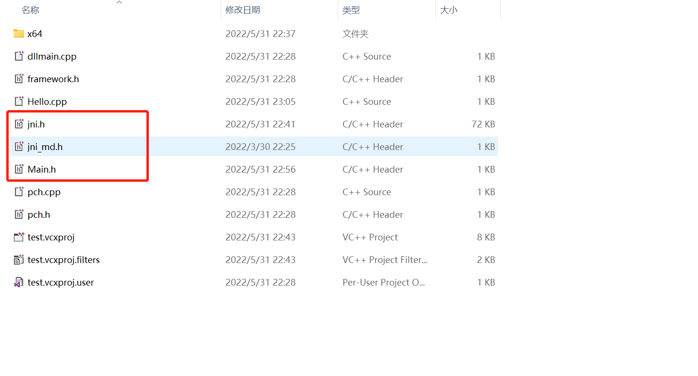

## 前言

在研读《深入理解Java虚拟机》这本书时，看到Java虚拟机运行时数据区中有关本地方法栈（Native Method Stack）的概念，本地方法栈就是为调用Native方法服务的，被Native修饰的方法不是由Java语言实现的，可以是C/C++实现，然后通过JNI（Java Native Interface）实现调用。当然也有Java虚拟机栈，是为Java方法服务的。本篇主要是想熟悉怎么样去调用Native方法。

## 通过JNI调用C++方法

- 通过java代码调用C++的方法

  ```java
  import java.io.File;
  
  public class Main {
  
      static {
          System.load("E:" + File.separator + "test.dll");
      }
  
      public native static void TestOne();
      public static void main(String[] args) {
          TestOne();
      }
  }
  ```

- 通过`javac Main.java`编译生成Main.class文件，然后执行`javah Main`会生成Main.h文件，目的就是为指定的类中的Native方式生成.h文件

- 通过visual studio 2022创建一个C++的项目test，生成的dll名称需要和上述Java代码中加载的类库名称要一致

  

- 将上面生成的Main.h，以及%JAVA_HOME/include/jni.h%和%JAVA_HOME/include/win32/jni_md.h%，三个文件复制到test目录下，如图所示：

  

- 将上面三个文件添加到头文件中

  

- 修改一下Main.h中的`#include <jni.h>`改成`#include "jni.h"`

- 添加C++源文件Hello.cpp并添加如下的内容

  ```java
  #include "pch.h"
  #include <iostream>
  #include "Main.h"
  using namespace std;
  
  JNIEXPORT void JNICALL Java_Main_TestOne
  (JNIEnv*, jclass)
  {
  	cout << "hello sherman" << endl;
  }
  ```

- 生成项目，复制test.dll，到E:\下(我这里是64位)

  

- 直接运行java程序可以看到输出结果："hello sherman"
