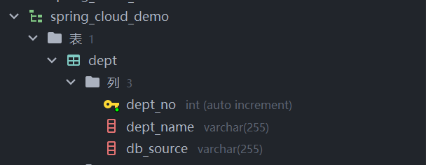
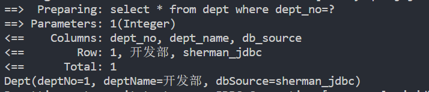

## 前言

mybatis可以简单地理解为一款持久层的框架，支持定制化SQL，存储过程以及高级映射。MyBatis 避免了几乎所有的 JDBC 代码和手动设置参数以及获取结果集。MyBatis 可以使用简单的 XML 或注解来配置和映射原生信息，将接口和 Java 的 POJOs(Plain Ordinary Java Object,普通的 Java对象)映射成数据库中的记录

## 示例

下面通过一个简单的示例体验一下mybatis，是如何操作数据库的，假设有一张表：dept



- 创建一个目录：mkdir mybatis_demo，添加pom.xml文件

内容如下：

```xml
<?xml version="1.0" encoding="utf-8"?>
<project xmlns="http://maven.apache.org/POM/4.0.0">
    <modelVersion>4.0.0</modelVersion>
    <groupId>com.sherman</groupId>
    <artifactId>demo</artifactId>
    <version>0.0.1-SNAPSHOP</version>

    <dependencies>
        <!-- 引入mybatis持久层-->
        <dependency>
            <groupId>org.mybatis</groupId>
            <artifactId>mybatis</artifactId>
            <version>3.5.10</version>
        </dependency>

        <!-- 连接mysql-->
        <dependency>
            <groupId>mysql</groupId>
            <artifactId>mysql-connector-java</artifactId>
            <version>8.0.29</version>
        </dependency>
        <!-- 引入lombok，简化代码-->
        <dependency>
            <groupId>org.projectlombok</groupId>
            <artifactId>lombok</artifactId>
            <version>1.18.24</version>
        </dependency>

    </dependencies>
</project>
```

先指定一些项目的基本信息和依赖项

- 创建实体类：src/main/java/com/sherman/demo/Dept.java(没有相关的目录，先创建)

  ```java
  package com.sherman.demo.entity;
  import lombok.Data;
  /**
   * Dept
   */
   @Data
  public class Dept {
      private int deptNo;
      private String deptName;
      private String dbSource;
  }
  ```

- 创建mapper类：src/main/java/com/sherman/demo/DeptMapper.java

  ```java
  package com.sherman.demo.mapper;
  import org.apache.ibatis.annotations.Mapper;
  import com.sherman.demo.entity.Dept;
  
  @Mapper
  public interface DeptMapper {
      /*
       * 根据Id获取部门信息
       */
      public Dept getDeptByDeptNo(int deptNo);
  }
  ```

- 添加项目配置文件：src/main/resources/application.yml(配置数据库连接)

  ```yaml
  driver: com.mysql.cj.jdbc.Driver
  url: jdbc:mysql://myubuntu.wsl:3306/spring_cloud_demo
  username: root
  password: 123456
  ```

- 添加mybatis的配置文件：src/main/resources/mybatis-config.xml

  ```xml
  <?xml version="1.0" encoding="UTF-8"?>
  
  <!DOCTYPE configuration PUBLIC "-//mybatis.org//DTD Config 3.0//EN" "http://mybatis.org/dtd/mybatis-3-config.dtd">
  <configuration>
      <!-- 读取外部的配置-->
      <properties resource="application.yml" />
      <settings>
          <!-- 打印mybatis，执行sql的日志-->
          <setting name="logImpl" value="STDOUT_LOGGING" />
          <!-- 自动兼容mysql数据库字段中带下划线-->
          <setting name="mapUnderscoreToCamelCase" value="true" />
      </settings>
      <environments default="development">
          <environment id="development">
              <transactionManager type="JDBC"/>
              <dataSource type="POOLED">
                  <property name="driver" value="${driver}" />
                  <property name="url" value="${url}" />
                  <property name="username" value="${username}" />
                  <property name="password" value="${password}" />
              </dataSource>
          </environment>
      </environments>
      <mappers>
          <mapper resource="mybatis/mapper/DeptMapper.xml"/>
      </mappers>
  </configuration>
  ```

- 添加mybatis中的sql映射文件：src/main/resources/mybatis/mapper/DeptMapper.xml

  ```xml
  <?xml version="1.0" encoding="UTF-8"?>
  <!DOCTYPE mapper PUBLIC "-//mybatis.org//DTD Mapper 3.0//EN" "http://mybatis.org/dtd/mybatis-3-mapper.dtd">
  <mapper namespace="com.sherman.demo.mapper.DeptMapper">
  
      <select id="getDeptByDeptNo" resultType="com.sherman.demo.entity.Dept">
          select * from dept
          where dept_no=#{deptNo,jdbcType=INTEGER}
      </select>
  </mapper>
  ```

- 创建启动类：src/main/java/com/sherman/demo/App.java

  ```java
  package com.sherman.demo;
  
  import java.io.InputStream;
  
  import org.apache.ibatis.io.Resources;
  import org.apache.ibatis.session.SqlSession;
  import org.apache.ibatis.session.SqlSessionFactory;
  import org.apache.ibatis.session.SqlSessionFactoryBuilder;
  
  import com.sherman.demo.entity.Dept;
  import com.sherman.demo.mapper.DeptMapper;
  
  /**
   * App
   */
  public class App {
  
      public static void main(String[] args) {
          try {
              InputStream inputStream = Resources.getResourceAsStream("mybatis-config.xml");
              SqlSessionFactory sqlSessionFactory = new SqlSessionFactoryBuilder().build(inputStream);
              SqlSession sqlSession = sqlSessionFactory.openSession();
              DeptMapper deptMapper = sqlSession.getMapper(DeptMapper.class);
              Dept dept = deptMapper.getDeptByDeptNo(1);
              System.out.println(dept.toString());
              sqlSession.close();
          } catch (Exception e) {
              e.printStackTrace();
          }
      }
  }
  ```

  输出结果：

  

## 
