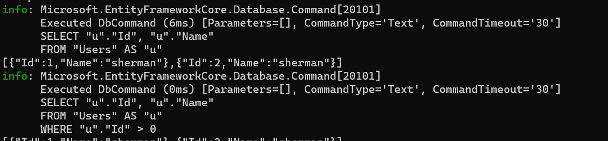

IEnumerable与IQueryable 都能实现延迟加载的目的，但是两者之间还是有一些区别的，下面我们通过实际的代码来进行验证，创建一个控制台项目，数据库使用sqlite，EFCore操作数据库

## 创建项目

```c#
dotnet new console -o queryable_enumerable
```

添加sqlite EF操作的类库的引用：

```C#
dotnet add package Microsoft.EntityFrameworkCore.Sqlite
dotnet add pacakge Microsoft.EntityFrameworkCore.Tools
```

还需要安装EF命令相关的类库

```C#
dotnet add package Microsoft.EntityFrameworkCore.Tools.DotNet
```

修改项目文件的内容如下：


## 添加数据操作类

创建DBContext类库：

```C#
internal class MyContext : DbContext
{
        public static readonly ILoggerFactory MyLoggerFactory
        = LoggerFactory.Create(builder =>
        {
        #if DEBUG
            builder.AddConsole();
        #endif
        });
        public DbSet<User> Users { get; set; }
        protected override void OnConfiguring(DbContextOptionsBuilder optionsBuilder)
        {
            //写完整地路径
            string connString = @"Data Source=E:\xxx\xxx\xxx\xxx\queryable_enumerable\testdb.db";
            optionsBuilder.UseSqlite(connString).UseLoggerFactory(MyLoggerFactory);
        }
  }
```

便于观察ef操作数据库的执行sql，这里将日志输出到控制台，需要引用类库Microsoft.Extensions.Logging.Console

```c#
dotnet add package Microsoft.Extensions.Logging.Console
```

添加 User实体类

```c#
internal class User
{
    [Key,DatabaseGenerated(DatabaseGeneratedOption.Identity)]
    public int Id { get; set; }
    [MaxLength(100), Required]
    public string Name { get; set; }
}
```

## 执行EF命令，更新数据库

```C#
dotnet ef migrations add "InitialCreate"
dotnet ef database update
```

## 添加、获取数据

```c#
// See https://aka.ms/new-console-template for more information
using queryable_enumerable;
using System.Text.Json;

Console.WriteLine("Hello, World!");

MyContext myContext = new();

//await myContext.Users.AddAsync(new User { Name = "sherman" });
//await myContext.SaveChangesAsync();

var users = myContext.Users.AsEnumerable().Where(p => p.Id > 0);

Console.WriteLine(JsonSerializer.Serialize(users));

var querable = myContext.Users.Where(p => p.Id > 0);  

Console.WriteLine(JsonSerializer.Serialize(querable));

myContext.Dispose();
```

运行程序之后，可以看到如下的输出：



从打印出的sql语句，我们可以知道，通过IEnumerable返回的数据，是一次性将所有的数据装入内存当中，然后进行过滤的操作，但是IQueryable是在数据库层就做了过滤，所以性能方面是有提升的。
