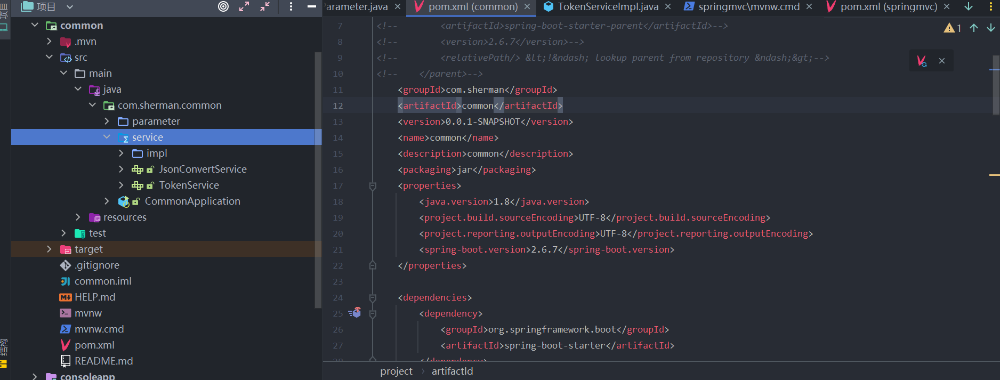
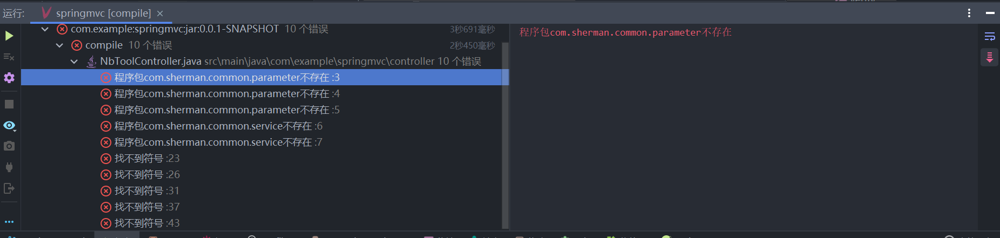
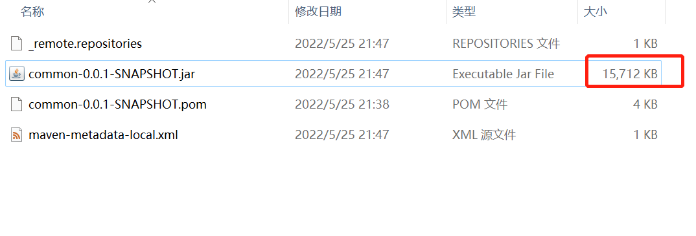
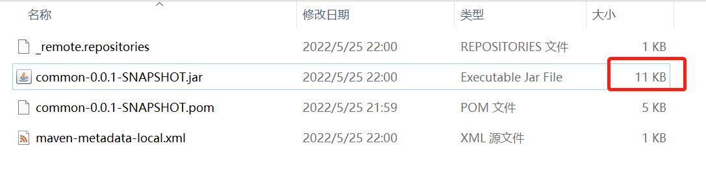

## 需求背景

在项目开发过程中，总会有一些公共的代码，会被抽取到一个单独的模块当中，其他的项通过引入该项目的jar包，达到代码复用的目的，近期在学习springboot相关知识，正好也遇到这种场景，但是引入公共的模块时，打包项目总是提示找不到公共项目中的相关类，下面就说说问题产生的原因和解决的办法。

## 代码示例

首先，创建一个公共的maven项目，artifactId：common，在其中添加一些公共的类，执行 mvn clean、mvn install命令



然后再创建一个maven项目，比如：springmvc(名字大家随便取)，引入common的依赖

```xml
<dependency>
    <groupId>com.sherman</groupId>
    <artifactId>common</artifactId>
    <version>0.0.1-SNAPSHOT</version>
    <scope>compile</scope>
</dependency>
```

编译springmvc项目，结果提示如下的错误信息：



截图中的错误提示都是我在common模块中定义的类，但是在springmvc项目中却提示找不到，这个问题是由于我在common项目中指定了`spring-boot-maven-plugin`这个插件生成jar包

```xml
<plugin>
                <groupId>org.springframework.boot</groupId>
                <artifactId>spring-boot-maven-plugin</artifactId>
                <configuration>
                    <mainClass>com.sherman.common.CommonApplication</mainClass>
                </configuration>
                <executions>
                    <execution>
                        <id>repackage</id>
                        <goals>
                            <goal>repackage</goal>
                        </goals>
                    </execution>
                </executions>
</plugin>
```

然后我把这个插件去掉，重新对common项目执行命令：mvn clean、mvn install，接着再重新编译springmvc项目，问题解决。 

如果运行springmvc项目提示“Consider defining a bean of type 'xxxx' 类似的错误信息，需要在springmvc项目的启动中添加`@ComponentScan`注解

```java
package com.example.springmvc;

import org.springframework.boot.SpringApplication;
import org.springframework.boot.autoconfigure.SpringBootApplication;
import org.springframework.context.annotation.ComponentScan;

@SpringBootApplication
@ComponentScan(basePackages = {"com.sherman.common"})
public class SpringmvcApplication {

    public static void main(String[] args) {
        SpringApplication.run(SpringmvcApplication.class, args);
    }
}

```


## 打包区别

通过上面的描述，是由于使用了`spring-boot-maven-plugin`进行打包，那通过该插件打包的程序一般是作为独立运行的jar，直接可以通过java -jar xxx.jar命令运行，而去掉这个插件之后就是生成了普通的jar包，只是包含模块中的代码，不包含依赖项，我们也可以通过观察生成的jar包文件的大小，来确认是否和描述的一致。

使用`spring-boot-maven-plugin`插件生成jar的大小如下图所示：



去掉`spring-boot-maven-plugin`之后生成的jar的大小如下图所示：



希望此文能帮助那些遇到和我一样问题的同学。
