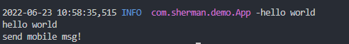
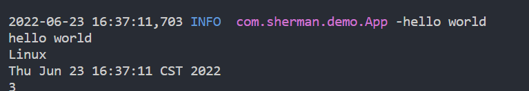

## 前言

IOC全程是Inversion of Control，控制反转。它是一种设计思想，对象的生命周期都是由容器控制。IOC的目的就是为了让程序更加松耦合。IOC的背后原来就是利用反射和工厂模式，下面我们通过几种方式来阐述一下spring中IOC是怎么使用的。

## 示例

下面我们通过一个示例，来看看，怎么样让对象交给spring IOC容器进行管理

- 创建文件夹：mkdir springioc_demo

- 在springioc_demo目录中添加pom.xml文件，内容如下：

  ```xml
  <?xml version="1.0" encoding="UTF-8"?>
  <project xmlns="http://maven.apache.org/POM/4.0.0">
  
      <modelVersion>4.0.0</modelVersion>
      <groupId>com.sherman</groupId>
      <artifactId>springioc_demo</artifactId>
      <version>0.0.1-SNAPSHOP</version>
      <name>springioc_demo</name>
  
      <dependencies>
          <!-- Spring容器的核心部分-->
          <dependency>
              <groupId>org.springframework</groupId>
              <artifactId>spring-context</artifactId>
              <version>5.3.21</version>
          </dependency>
          <!-- 简化代码-->
          <dependency>
              <groupId>org.projectlombok</groupId>
              <artifactId>lombok</artifactId>
              <version>1.18.24</version>
          </dependency>
          <!-- 使用logback记录日志-->
          <dependency>
              <groupId>ch.qos.logback</groupId>
              <artifactId>logback-classic</artifactId>
              <version>1.3.0-alpha16</version>
          </dependency>
  
      </dependencies>
  </project>
  ```

- 添加logback的配置文件：src/main/resources/logback.xml

  ```xml
  <?xml version="1.0" encoding="UTF-8" ?>
  <configuration>
      <logger name="org.springframework" level="ERROR"/>
      <logger name="com.sherman" level="INFO"/>
  
      <appender name="consoleAppender" class="ch.qos.logback.core.ConsoleAppender">
          <encoder>
              <Pattern>
                  %d %blue(%-5level) %magenta(%logger{36}) -%msg %n
              </Pattern>
          </encoder>
      </appender>
  
      <root>
          <level value="INFO"/>
          <appender-ref ref="consoleAppender"/>
      </root>
  </configuration>
  ```

  

- 添加项目启动文件：src/main/java/com/sherman/demo/App.java

  ```java
  package com.sherman.demo;
  
  import lombok.extern.slf4j.Slf4j;
  
  @Slf4j
  public class App {
      public static void main(String[] args) {
          log.info("hello world");
          System.out.println("hello world");
      }
  }
  
  ```

  之后，项目就可以正常运行了。

  #### 方式一：@Configuration+@Bean注解的方式

  - 添加服务：src/main/java/com/sherman/demo/service/MessageService.java，代码如下：

    ```java
    package com.sherman.demo.service;
    
    public class MessageService {
        public void sendSms(){
            System.out.println("send mobile msg!");
        }
    }
    ```

  - 添加配置：src/main/java/com/sherman/demo/config/AppConfig.java

    ```java
    package com.sherman.demo.config;
    
    import org.springframework.context.annotation.Bean;
    import org.springframework.context.annotation.Configuration;
    
    import com.sherman.demo.service.MessageService;
    
    @Configuration
    public class AppConfig {
        
        @Bean
        public MessageService getMessageService(){
            return new MessageService();
        }
    }
    ```

  - 修改src/main/java/com/sherman/demo/App.java中的代码：通过*AnnotationConfigApplicationContext*实现基于Java的配置类加载Spring的应用上下文。避免使用xml文件进行配置，相比xml配置，更加便捷。

    ```java
    package com.sherman.demo;
    import org.springframework.context.annotation.AnnotationConfigApplicationContext;
    import com.sherman.demo.service.MessageService;
    import lombok.extern.slf4j.Slf4j;
    
    @Slf4j
    public class App {
        public static void main(String[] args) {
            log.info("hello world");
            System.out.println("hello world");
    
            AnnotationConfigApplicationContext annotationConfigApplicationContext = new AnnotationConfigApplicationContext(
                    "com.sherman");//AnnotationConfigApplicationContext有3种使用方式，这只是其中一种，可以参考构造函数
            MessageService messageService = annotationConfigApplicationContext.getBean(MessageService.class);
            messageService.sendSms();
        }
    }
    
    ```

    输出：

    

  #### 方式二：@Service等注解的方式

  - 添加服务：src/main/java/com/sherman/demo/service/HelloWorldService.java

    ```java
    package com.sherman.demo.service;
    
    import org.springframework.stereotype.Service;
    
    @Service //添加@Service注解
    public class HelloWorldService {
        public void sayHello(){
            System.out.println("hello sherman!");
        }
    }
    ```

  - 修改src/main/java/com/sherman/demo/App.java中的代码

    ```java
    package com.sherman.demo;
    import org.springframework.context.annotation.AnnotationConfigApplicationContext;
    import com.sherman.demo.service.HelloWorldService;
    import lombok.extern.slf4j.Slf4j;
    
    @Slf4j
    public class App {
        public static void main(String[] args) {
            log.info("hello world");
            System.out.println("hello world");
    
            AnnotationConfigApplicationContext annotationConfigApplicationContext = new AnnotationConfigApplicationContext(
                    "com.sherman");
            HelloWorldService helloWorldService = annotationConfigApplicationContext.getBean(HelloWorldService.class);
            helloWorldService.sayHello();
        }
    }
    
    ```

    

  #### 方式三：@Import注解的方式

  @Import直接有三种使用方式，下面分别举例说明一下

  ##### 普通的类

  - 添加服务：src/main/java/com/sherman/demo/service/ComputerService.java

    ```java
    package com.sherman.demo.service;
    
    public class ComputerService {
        public void getSystemName(){
            System.out.println(System.getProperty("os.name"));
        }
    }
    ```

    

  ##### 实现ImportSelector接口

  - 添加服务：src/main/java/com/sherman/demo/service/DateService.java

    ```java
    package com.sherman.demo.service;
    
    import java.util.Date;
    
    public class DateService {
        public void printDate(){
            System.out.println(new Date());
        }
    }
    ```

  - 实现接口ImportSelector

    ```java
    package com.sherman.demo.config;
    
    import org.springframework.context.annotation.ImportSelector;
    import org.springframework.core.type.AnnotationMetadata;
    
    public class MyImportSelector implements ImportSelector {
    
        public String[] selectImports(AnnotationMetadata importingClassMetadata) {
            return new String[]{"com.sherman.demo.service.DateService"};
        }
    }
    ```

    

  ##### 实现ImportBeanDefinitionRegistrar接口

  - 添加服务：src/main/java/com/sherman/demo/service/CalculationService.java

    ```java
    package com.sherman.demo.service;
    
    public class CalculationService {
        public int add(int a, int b) {
            return a + b;
        }
    }
    ```

  - 实现ImportBeanDefinitionRegistrar接口

    ```java
    package com.sherman.demo.config;
    
    import org.springframework.beans.factory.support.BeanDefinitionRegistry;
    import org.springframework.beans.factory.support.RootBeanDefinition;
    import org.springframework.context.annotation.ImportBeanDefinitionRegistrar;
    import org.springframework.core.type.AnnotationMetadata;
    
    import com.sherman.demo.service.CalculationService;
    
    /**
     * MyImportBeanDefinitionRegister
     */
    public class MyImportBeanDefinitionRegister implements ImportBeanDefinitionRegistrar {
    
        public void registerBeanDefinitions(AnnotationMetadata importingClassMetadata, BeanDefinitionRegistry registry){
            RootBeanDefinition rootBeanDefinition = new RootBeanDefinition(CalculationService.class);
            registry.registerBeanDefinition("calcuationService", rootBeanDefinition);
        }
    }
    ```

  修改：src/main/java/com/sherman/demo/config/AppConfig.java，通过import导入需要的类

  ```java
  package com.sherman.demo.config;
  
  import org.springframework.context.annotation.Bean;
  import org.springframework.context.annotation.Configuration;
  import org.springframework.context.annotation.Import;
  
  import com.sherman.demo.service.ComputerService;
  import com.sherman.demo.service.MessageService;
  
  @Configuration
  @Import({ComputerService.class, MyImportSelector.class, MyImportBeanDefinitionRegister.class})
  public class AppConfig {
      
      @Bean
      public MessageService getMessageService(){
          return new MessageService();
      }
  }
  ```

  验证是否能够从IOC容器中获取到注入的对象

  ```java
  package com.sherman.demo;
  
  import org.springframework.context.annotation.AnnotationConfigApplicationContext;
  
  import com.sherman.demo.service.CalculationService;
  import com.sherman.demo.service.ComputerService;
  import com.sherman.demo.service.DateService;
  
  import lombok.extern.slf4j.Slf4j;
  
  @Slf4j
  public class App {
      public static void main(String[] args) {
          log.info("hello world");
          System.out.println("hello world");
  
          AnnotationConfigApplicationContext annotationConfigApplicationContext = new AnnotationConfigApplicationContext(
                  "com.sherman");
          ComputerService computerService = annotationConfigApplicationContext.getBean(ComputerService.class);
          computerService.getSystemName();
  
          DateService dateService = annotationConfigApplicationContext.getBean(DateService.class);
          dateService.printDate();
  
          CalculationService calculationService = annotationConfigApplicationContext.getBean(CalculationService.class);
          System.out.println(calculationService.add(1, 2));
      }
  }
  
  ```

  通过输出结果可以看到，也能从IOC容器中获取到对象：

  
