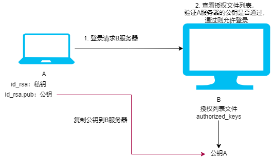

## 免密流程

假设有两台Linux的服务器，A(192.168.240.1)、B(192.168.240.2)，现在想通过A服务器免密登录B服务器，那么首先需要将A服务器的SSH公钥复制到B服务器的授权列表文件中（就是authorized_keys文件中）

## 操作流程

1. 在A服务器上生成密钥：`ssh-keygen -t rsa`，都采用默认的配置，直接回车即可

2. 默认生成的密钥是保存在`/home/sherman/.ssh`目录下（根据自己的情况），直接复制到B服务器上，例如：

   `scp id_rsa.pub test@192.168.240.2:/home/test `

3. 在B服务器上以同样的方式生成密钥：`ssh-keygen -t rsa`，都默认回车，同样在`/home/test/.ssh` 目录下生成了私钥文件（id_rsa）和公钥文件（id_rsa_pub）

4. 将A服务器的公钥添加到B服务器的/home/test/.ssh/authorized_keys文件中，如果没有就创建一个：`touch authorized_keys` 注意：authorized_keys的权限为 -rw------，就是只有test这个用户可以读写，其他的都没有权限

   可以通过命令设置访问权限：`chmod 600 authorized_keys`

   cat ../id_rsa_pub >> authorized_keys

5. 在A服务器上输入：`ssh test@192.168.240.2`  登录成功
