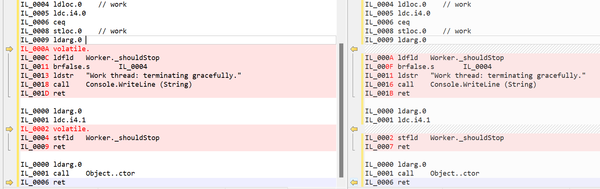
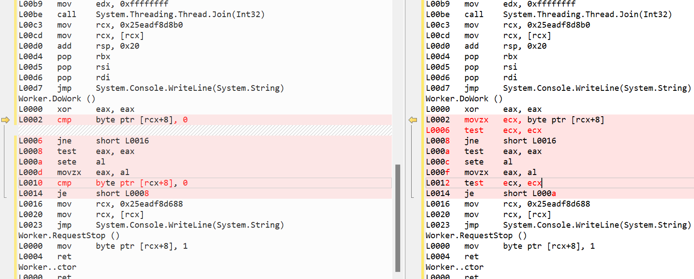

## volatile使用说明

`volatile` 关键字指示一个字段可以由多个同时执行的线程修改。

出于性能原因，编译器，运行时系统甚至硬件都可能重新排列对存储器位置的读取和写入。声明为 `volatile` 的字段将从某些类型的优化中排除。不确保从所有执行线程整体来看时所有易失性写入操作均按执行顺序排序。

`volatile` 关键字可应用于以下类型的字段：

- 引用类型。
- 指针类型（在不安全的上下文中）。 请注意，虽然指针本身可以是可变的，但是它指向的对象不能是可变的。 换句话说，不能声明“指向可变对象的指针”。
- 简单类型，如 `sbyte`、`byte`、`short`、`ushort`、`int`、`uint`、`char`、`float` 和 `bool`。
- 具有以下基本类型之一的 `enum` 类型：`byte`、`sbyte`、`short`、`ushort`、`int` 或 `uint`。
- 已知为引用类型的泛型类型参数。
- [IntPtr](https://docs.microsoft.com/zh-cn/dotnet/api/system.intptr) 和 [UIntPtr](https://docs.microsoft.com/zh-cn/dotnet/api/system.uintptr)。

其他类型（包括 `double` 和 `long`）无法标记为 `volatile`，因为对这些类型的字段的读取和写入不能保证是原子的。 若要保护对这些类型字段的多线程访问，请使用 [Interlocked](https://docs.microsoft.com/zh-cn/dotnet/api/system.threading.interlocked) 类成员或使用 [`lock`](https://docs.microsoft.com/zh-cn/dotnet/csharp/language-reference/statements/lock) 语句保护访问权限。

`volatile` 关键字只能应用于 `class` 或 `struct` 的字段。 不能将局部变量声明为 `volatile`。

## 示例

```C#
Worker worker = new Worker();
Thread workerThread = new Thread(worker.DoWork);
workerThread.Start();
Console.WriteLine("Main thread: starting worker thread...");

while (!workerThread.IsAlive) ;

Thread.Sleep(500);

worker.RequestStop();

workerThread.Join();
Console.WriteLine("Main thread：worker thread has terminated.");

public class Worker
{
    private bool _shouldStop;
    public void DoWork()
    {
        bool work = false;
        while (!_shouldStop)
        {
            work = !work;
        }
        Console.WriteLine("Work thread: terminating gracefully.");
    }

    public void RequestStop()
    {
        _shouldStop = true;
    }
}
```

使用Debug模式运行时，可以看到如下的运行结果：

```shell
Main thread: starting worker thread...
Work thread: terminating gracefully.
Main thread：worker thread has terminated.
```

切换到Release模式运行时，可以看到如下的运行结果：

```shell
Main thread: starting worker thread...
```

程序一直结束不了

从运行结果上，我们可以看到编译器对字段 `_shouldStop`进行优化，Release模式下读取的都是缓存（副本）的值。

## 问题解决

为了解决上述因为编译器优化而导致的运行结果不稳定的情况，可以通过volatile关键字解决

```C#
private volatile bool _shouldStop;
```

只需要用`volatile`修饰字段`_shouldStop`即可，再次运行

```shell
Main thread: starting worker thread...
Work thread: terminating gracefully.
Main thread：worker thread has terminated.
```

可以得到我们想要的结果

## 原理分析

通过linqpad，查看代码生成的IL，左边的是加了`volatile`关键字修饰的，右边则没有



从生成的IL可以看出，就是多了一个 `volatile.`指令，该指令的解释：指定当前位于计算堆栈顶部的地址可以是易失的，并且读取该位置的结果不能被缓存，或者对该地址的多个存储区不能被取消。我总结的一句就是，读取的总是最新的值。下面我们也可以通过观察汇编代码的差异得出相同的结论。

通过linqpad，查看生成的汇编代码，左边的是加了`volatile`关键字修饰的，右边则没有



通过差异发现，加了`volatile`关键字的，直接比较的是地址指向的内容，用的都是最新的值，而没有加关键字的则是：首先通过movzx指令，将地址指向的内容放入到了ecx寄存器中，后面一直比较的也是ecx寄存器中的值，没有拿到最新的值。这样导致的结果就是我们上面程序运行的结果，循环一直不能结束。

结论：如果存在多线程访问上述类型的字段的话，保险的方式就是通过volatile关键字进行修饰，告诉编译器不需要对该字段进行优化，从而可以每次都能获取到最新的值
