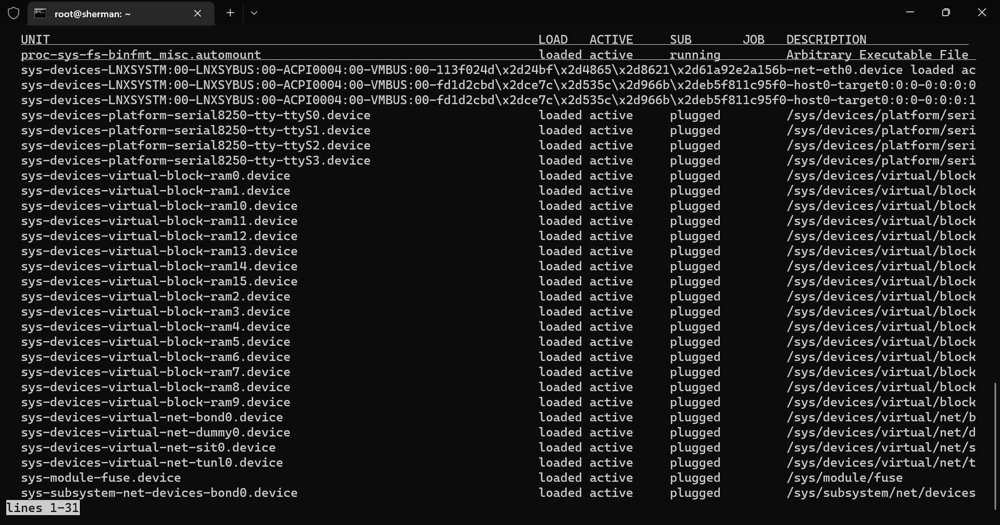

在wsl系统中执行sytemctl会报如下的错误：System has not been booted with systemd as init system (PID 1). Can‘t operate，这是因为安装systemctl的原因，可以通过如下的步骤进行配置

- 安装daemonize和fontconfig：sudo apt install -y daemonize fontconfig

- 编辑/etc/profile文件，添加如下的脚本

  ```sheLl
  SYSTEMD_PID=$(ps -ef | grep '/lib/systemd/systemd --system-unit=basic.target$' | grep -v unshare | awk '{print $2}')
  
  if [ -z "$SYSTEMD_PID" ]; then
     sudo /usr/bin/daemonize /usr/bin/unshare --fork --pid --mount-proc /lib/systemd/systemd --system-unit=basic.target
     SYSTEMD_PID=$(ps -ef | grep '/lib/systemd/systemd --system-unit=basic.target$' | grep -v unshare | awk '{print $2}')
  fi
  
  if [ -n "$SYSTEMD_PID" ] && [ "$SYSTEMD_PID" != "1" ]; then
      exec sudo /usr/bin/nsenter -t $SYSTEMD_PID -a su - $LOGNAME
  fi
  ```

- 编辑 /etc/sudoers，添加如下的脚本

  ```shell
  %sudo ALL=(ALL) NOPASSWD: /usr/sbin/daemonize /usr/bin/unshare --fork --pid --mount-proc /lib/systemd/systemd --system-unit=basic.target
  %sudo ALL=(ALL) NOPASSWD: /usr/bin/nsenter -t [0-9]* -a su - [a-zA-Z0-9]*
  ```

- 执行命令：sudo source /etc/profile或者重启 wsl2
- 执行systemctl命令



可以看到执行成功！
